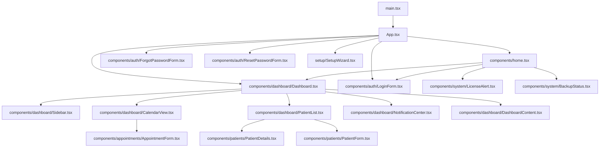
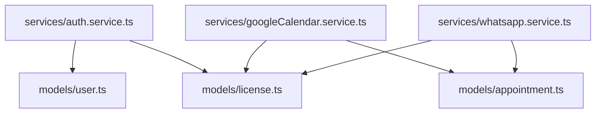

# Documentazione Tecnica - Sistema di Gestione Appuntamenti

## Indice
1. [Panoramica dell'Architettura](#panoramica-dellarchitettura)
2. [Struttura del Progetto](#struttura-del-progetto)
3. [Dipendenze tra File](#dipendenze-tra-file)
4. [Modelli e Database](#modelli-e-database)
5. [Servizi](#servizi)
6. [Componenti UI](#componenti-ui)
7. [Routing](#routing)
8. [Autenticazione](#autenticazione)
9. [Integrazioni Esterne](#integrazioni-esterne)
10. [Setup Wizard](#setup-wizard)
11. [Manutenzione e Modifiche](#manutenzione-e-modifiche)

## Panoramica dell'Architettura

Il Sistema di Gestione Appuntamenti è un'applicazione React che utilizza un'architettura a tre livelli:

1. **Livello di Presentazione**: Componenti React che formano l'interfaccia utente
2. **Livello di Servizio**: Classi di servizio che implementano la logica di business
3. **Livello di Dati**: Modelli che interagiscono con il database

L'applicazione è progettata per funzionare in locale, con un database PostgreSQL per la persistenza dei dati. Include integrazioni con Google Calendar e WhatsApp per la sincronizzazione degli appuntamenti e l'invio di notifiche.

## Struttura del Progetto

```
src/
├── components/         # Componenti UI React
├── lib/               # Utility e mock per ambiente browser
├── models/            # Modelli di dati e interazione con DB
├── services/          # Servizi di business logic
├── setup/             # Wizard di configurazione integrato
├── App.tsx            # Componente principale e routing
└── main.tsx           # Entry point dell'applicazione

electron/              # Codice specifico per Electron
├── main.js            # Processo principale Electron
├── preload.js         # Script di preload per sicurezza
└── setup.js           # Gestione del setup wizard standalone

setup-wizard/          # Setup wizard standalone
├── index.html         # Interfaccia utente HTML
└── setup-wizard.js    # Logica JavaScript del wizard

license-generator/     # Generatore di licenze standalone
├── index.html         # Interfaccia utente HTML
└── license-generator.js # Logica JavaScript del generatore
```

## Dipendenze tra File

### Dipendenze Principali



### Dipendenze dei Servizi



## Modelli e Database

### Schema del Database

Il database PostgreSQL contiene le seguenti tabelle:

1. **users**: Utenti del sistema (medici e assistenti)
2. **patients**: Anagrafica pazienti
3. **appointments**: Appuntamenti
4. **license**: Informazioni sulla licenza
5. **configurations**: Configurazioni di sistema

### Modelli e loro Relazioni con il Database

| Modello | File | Tabella DB | Operazioni |
|---------|------|------------|------------|
| UserModel | models/user.ts | users | create, findByUsername, findByEmail, findById, update, delete, authenticate, resetPassword |
| PatientModel | models/patient.ts | patients | create, findById, findByCodiceFiscale, findAll, update, delete |
| AppointmentModel | models/appointment.ts | appointments | create, findById, findByPatientId, findByDateRange, findByDate, findUpcoming, update, delete, updateGoogleCalendarSync, updateWhatsAppNotification, findPendingNotifications |
| LicenseModel | models/license.ts | license | getCurrentLicense, isLicenseValid, getDaysUntilExpiry, isGoogleCalendarEnabled, isWhatsAppEnabled, installLicense, verifyLicenseKey |
| Database | models/database.ts | Tutte | connect, query, getClient, close, initializeDatabase |

## Servizi

### AuthService (services/auth.service.ts)

Gestisce l'autenticazione degli utenti e la verifica della licenza.

**Metodi principali**:
- **login**: Autentica un utente e verifica la validità della licenza
- **logout**: Disconnette l'utente corrente
- **getCurrentUser**: Ottiene l'utente correntemente autenticato
- **isAuthenticated**: Verifica se un utente è autenticato
- **requestPasswordReset**: Richiede un reset della password
- **resetPassword**: Reimposta la password con un token di reset

**Dipendenze**:
- UserModel
- LicenseModel

### GoogleCalendarService (services/googleCalendar.service.ts)

Gestisce l'integrazione con Google Calendar per la sincronizzazione degli appuntamenti.

**Metodi principali**:
- **isServiceEnabled**: Verifica se il servizio è abilitato dalla licenza
- **isServiceAuthenticated**: Verifica se il servizio è autenticato
- **authenticate**: Autentica l'applicazione con Google
- **syncAppointment**: Sincronizza un appuntamento con Google Calendar
- **deleteAppointment**: Elimina un appuntamento da Google Calendar
- **syncAllAppointments**: Sincronizza tutti gli appuntamenti futuri
- **disconnect**: Disconnette l'integrazione

**Dipendenze**:
- LicenseModel
- AppointmentModel

### WhatsAppService (services/whatsapp.service.ts)

Gestisce l'integrazione con WhatsApp per l'invio di notifiche automatiche.

**Metodi principali**:
- **isServiceEnabled**: Verifica se il servizio è abilitato dalla licenza
- **isServiceAuthenticated**: Verifica se il servizio è autenticato
- **configure**: Configura il servizio con i percorsi del browser e dei dati
- **authenticate**: Autentica WhatsApp Web
- **sendNotification**: Invia una notifica WhatsApp
- **sendAppointmentConfirmation**: Invia una conferma di appuntamento
- **sendAppointmentReminder**: Invia un promemoria di appuntamento
- **processPendingNotifications**: Elabora tutte le notifiche in attesa
- **disconnect**: Disconnette l'integrazione

**Dipendenze**:
- LicenseModel
- AppointmentModel

## Componenti UI

### Componenti Principali

| Componente | File | Descrizione |
|------------|------|-------------|
| App | src/App.tsx | Componente principale che gestisce il routing |
| Home | src/components/home.tsx | Pagina iniziale con login o dashboard |
| LoginForm | src/components/auth/LoginForm.tsx | Form di login |
| ForgotPasswordForm | src/components/auth/ForgotPasswordForm.tsx | Form per recupero password |
| ResetPasswordForm | src/components/auth/ResetPasswordForm.tsx | Form per reimpostare la password |
| Dashboard | src/components/dashboard/Dashboard.tsx | Layout principale dopo il login |
| Sidebar | src/components/dashboard/Sidebar.tsx | Barra laterale di navigazione |
| CalendarView | src/components/dashboard/CalendarView.tsx | Vista calendario appuntamenti |
| PatientList | src/components/dashboard/PatientList.tsx | Lista pazienti con ricerca e paginazione |
| NotificationCenter | src/components/dashboard/NotificationCenter.tsx | Centro notifiche WhatsApp |
| DashboardContent | src/components/dashboard/DashboardContent.tsx | Contenuto principale della dashboard |
| AppointmentForm | src/components/appointments/AppointmentForm.tsx | Form per creazione/modifica appuntamenti |
| PatientForm | src/components/patients/PatientForm.tsx | Form per creazione/modifica pazienti |
| PatientDetails | src/components/patients/PatientDetails.tsx | Dettagli paziente con schede |
| Settings | src/components/settings/Settings.tsx | Impostazioni dell'applicazione |
| BackupStatus | src/components/system/BackupStatus.tsx | Stato dei backup |
| LicenseAlert | src/components/system/LicenseAlert.tsx | Avviso scadenza licenza |
| SetupWizard | src/setup/SetupWizard.tsx | Wizard di configurazione integrato |
| NotificationTemplates | src/components/settings/NotificationTemplates.tsx | Gestione template per notifiche WhatsApp |

## Routing

L'applicazione utilizza React Router per la gestione delle rotte. Le rotte sono definite nel componente App.tsx.

```jsx
<Routes>
  <Route path="/" element={<Home />} />
  <Route path="/calendar" element={<CalendarView />} />
  <Route path="/patients" element={<PatientList />} />
  <Route path="/patients/new" element={<PatientForm />} />
  <Route path="/patients/:id" element={<PatientDetails />} />
  <Route path="/patients/:id/edit" element={<PatientForm />} />
  <Route path="/notifications" element={<NotificationCenter />} />
  <Route path="/settings" element={<Settings />} />
  <Route path="/forgot-password" element={<ForgotPasswordForm />} />
  <Route path="/reset-password" element={<ResetPasswordForm />} />
  <Route path="/setup" element={<SetupWizard />} />
</Routes>
```

## Autenticazione

Il sistema di autenticazione è gestito dal servizio AuthService.

### Processo di Login

1. L'utente inserisce username e password nel LoginForm
2. AuthService.login verifica le credenziali contro il database
3. Viene verificata anche la validità della licenza
4. Se tutto è valido, l'utente viene autenticato e reindirizzato alla dashboard

### Gestione della Sessione

La sessione utente è gestita tramite localStorage:

- `currentUser`: Dati dell'utente autenticato
- `authToken`: Token di autenticazione
- `isAuthenticated`: Flag che indica se l'utente è autenticato

### Recupero Password

1. L'utente richiede il reset della password tramite ForgotPasswordForm
2. Viene generato un token di reset e (in un'implementazione reale) inviato via email
3. L'utente utilizza il token per accedere al ResetPasswordForm
4. La nuova password viene salvata nel database

## Integrazioni Esterne

### Google Calendar

L'integrazione con Google Calendar è gestita dal servizio GoogleCalendarService.

**Configurazione**:
1. L'utente deve avere una licenza che include l'integrazione Google Calendar
2. L'utente configura le credenziali OAuth2 (Client ID, Client Secret, URI di reindirizzamento)
3. L'applicazione si autentica con Google

**Sincronizzazione**:
- Gli appuntamenti vengono sincronizzati automaticamente con Google Calendar
- Le modifiche agli appuntamenti vengono propagate a Google Calendar
- Gli appuntamenti eliminati vengono rimossi da Google Calendar

### WhatsApp

L'integrazione con WhatsApp è gestita dal servizio WhatsAppService.

**Configurazione**:
1. L'utente deve avere una licenza che include l'integrazione WhatsApp
2. L'utente configura il percorso del browser Chrome/Chromium e il percorso dei dati
3. L'applicazione avvia WhatsApp Web e l'utente scansiona il codice QR

**Percorso Dati WhatsApp**:
Il percorso dati WhatsApp è una directory dove vengono salvati i dati di sessione di WhatsApp Web, come i cookie e le informazioni di autenticazione. Questo permette all'applicazione di mantenere la sessione WhatsApp attiva tra un riavvio e l'altro, senza dover scansionare nuovamente il codice QR. Questa directory contiene:

- File di sessione di WhatsApp Web
- Cookie del browser Chrome/Chromium
- Dati di autenticazione
- Preferenze dell'utente per WhatsApp Web

L'applicazione crea automaticamente questa directory se non esiste già. È importante che l'utente abbia i permessi di scrittura per questa directory.

**Implementazione Tecnica**:
L'integrazione WhatsApp utilizza il browser Chrome/Chromium per aprire WhatsApp Web. Quando l'utente clicca su "Autentica WhatsApp Web", l'applicazione avvia Chrome con il percorso dati specificato e apre web.whatsapp.com. L'utente deve quindi scansionare il codice QR con il proprio telefono per autenticarsi. Una volta autenticato, l'applicazione può inviare notifiche WhatsApp ai pazienti.

Per il corretto funzionamento, è necessario:
1. Installare Chrome/Chromium sul computer
2. Specificare il percorso corretto dell'eseguibile Chrome nelle impostazioni
3. Specificare una directory per i dati WhatsApp dove l'applicazione ha permessi di scrittura
4. Avere una connessione Internet attiva
5. Avere WhatsApp installato sul telefono e configurato con il numero che si intende utilizzare per l'invio delle notifiche

**Notifiche**:
- Conferme di appuntamento: inviate quando viene creato un nuovo appuntamento
- Promemoria: inviati il giorno prima dell'appuntamento
- Notifiche manuali: l'utente può inviare notifiche personalizzate

**Implementazione Tecnica**:
L'implementazione attuale è una simulazione. In un'implementazione reale, il servizio utilizzerebbe Selenium WebDriver per controllare un'istanza di Chrome/Chromium e interagire con WhatsApp Web. Il browser verrebbe avviato in modalità headless (senza interfaccia grafica) per le operazioni automatiche, ma con interfaccia grafica per la scansione iniziale del codice QR.

## Setup Wizard

Il sistema include due versioni del Setup Wizard per la configurazione iniziale dell'applicazione:

### Versione Integrata (Browser)

Implementata come componente React in `src/setup/SetupWizard.tsx`, questa versione è integrata nell'applicazione principale e accessibile tramite la rotta `/setup`.

**Caratteristiche**:
- Interfaccia utente React con componenti shadcn/ui
- Accesso tramite rotta `/setup` nell'applicazione principale
- Reindirizzamento automatico al primo avvio
- Utilizza le stesse API dell'applicazione principale

### Versione Standalone (Desktop)

Implementata come applicazione HTML/JavaScript separata in `setup-wizard/`, questa versione è progettata per essere eseguita come applicazione standalone prima dell'avvio dell'applicazione principale.

**Caratteristiche**:
- Interfaccia utente HTML/CSS/JavaScript pura
- Eseguita in una finestra Electron separata
- Comunicazione con il processo principale tramite IPC
- Avviata automaticamente al primo avvio o quando la configurazione è mancante

**File principali**:
- `setup-wizard/index.html`: Interfaccia utente HTML
- `setup-wizard/setup-wizard.js`: Logica JavaScript per i passaggi del wizard
- `electron/setup.js`: Gestione della finestra Electron e comunicazione IPC
- `electron/setup-preload.js`: Script di preload per esporre API sicure

### Processo di Setup

Entrambe le versioni guidano l'utente attraverso gli stessi passaggi di configurazione:

1. **Configurazione Database**: Connessione a PostgreSQL e creazione delle tabelle
2. **Creazione Utente Admin**: Configurazione dell'account amministratore iniziale
3. **Installazione Licenza**: Validazione e installazione della chiave di licenza
4. **Configurazione Google Calendar** (opzionale): Setup dell'integrazione con Google API
5. **Configurazione WhatsApp** (opzionale): Setup delle notifiche WhatsApp
6. **Impostazioni Server**: Configurazione del server dell'applicazione
7. **Impostazioni Backup**: Configurazione dei backup automatici
8. **Impostazioni Generali**: Configurazione delle informazioni della clinica e preferenze

### Utilizzo della Versione Standalone

1. **Avvio durante lo sviluppo**:
   - Navigare nella cartella `setup-wizard`
   - Eseguire `npx http-server` per avviare un server locale
   - Aprire il browser all'indirizzo mostrato (tipicamente http://localhost:8080)

2. **Avvio nell'applicazione finale**:
   - Al primo avvio dell'applicazione, viene verificato se il setup è stato completato
   - Se non è stato completato, viene avviato automaticamente il Setup Wizard standalone

### Memorizzazione delle Configurazioni

Le configurazioni vengono salvate in diversi modi:

1. **Database PostgreSQL**: Tabella `configurations` per le impostazioni dell'applicazione
2. **Directory Dati Utente**: File JSON nella directory dei dati utente di Electron
   - `dbConfig.json`: Configurazione del database
   - `user.json`: Credenziali dell'utente amministratore
   - `license.json`: Informazioni sulla licenza
   - `config/*.json`: Altre configurazioni specifiche
3. **Marker di Completamento**: File `setup-completed` nella directory dei dati utente

### Reset del Setup in Ambiente Standalone

In alcune situazioni potrebbe essere necessario resettare il setup dell'applicazione, ad esempio per problemi di configurazione o per reinstallare l'applicazione. Ecco i metodi disponibili per resettare il setup:

#### Metodo 1: Utilizzo dello Script di Reset

L'applicazione include uno script dedicato per il reset del setup:

1. Aprire un terminale o prompt dei comandi
2. Navigare nella directory dell'applicazione
3. Eseguire il comando: `electron electron/reset-setup.js`
4. Confermare l'operazione quando richiesto
5. Riavviare l'applicazione

Questo script esegue le seguenti operazioni:
- Elimina il file marker `setup-completed` dalla directory dei dati utente
- Elimina i file di configurazione (`dbConfig.json`, `user.json`, `license.json`)
- Ripristina le impostazioni predefinite

#### Metodo 2: Eliminazione Manuale del File Marker

È possibile resettare il setup eliminando manualmente il file che indica che il setup è stato completato:

1. Chiudere completamente l'applicazione
2. Navigare nella directory dei dati utente di Electron:
   - Windows: `%APPDATA%\PatientAppointmentSystem`
   - macOS: `~/Library/Application Support/PatientAppointmentSystem`
   - Linux: `~/.config/PatientAppointmentSystem`
3. Eliminare il file `setup-completed`
4. Opzionalmente, eliminare anche i file di configurazione (`dbConfig.json`, `user.json`, `license.json`) per un reset completo
5. Riavviare l'applicazione

Al successivo avvio, l'applicazione rileverà l'assenza del file marker e avvierà automaticamente il Setup Wizard.

#### Metodo 3: Reset Completo (Incluso Database)

Per un reset completo che include anche il database:

1. Eseguire uno dei metodi precedenti per resettare il setup
2. Accedere a PostgreSQL (tramite pgAdmin o riga di comando)
3. Eliminare il database dell'applicazione: `DROP DATABASE nome_database;`
4. Riavviare l'applicazione e completare nuovamente il setup

**Nota**: Questo metodo comporta la perdita di tutti i dati. Assicurarsi di eseguire un backup se necessario.

## Manutenzione e Modifiche

### Aggiunta di Nuove Funzionalità

1. **Nuovi Componenti UI**:
   - Creare il nuovo componente in `src/components/`
   - Aggiungere la rotta in `App.tsx` se necessario
   - Aggiornare la navigazione in `Sidebar.tsx` e/o `TopNavigation.tsx`

2. **Nuove Funzionalità di Database**:
   - Aggiungere i nuovi campi/tabelle in `models/database.ts` nel metodo `initializeDatabase`
   - Creare o aggiornare il modello corrispondente in `src/models/`
   - Aggiornare i servizi che utilizzano il modello

3. **Nuove Integrazioni**:
   - Creare un nuovo servizio in `src/services/`
   - Aggiornare il modello `License` per includere il controllo della nuova funzionalità
   - Aggiungere l'interfaccia utente per la configurazione in `Settings.tsx`

### Gestione delle Licenze

Per modificare il sistema di licenze:

1. Aggiornare `models/license.ts` con i nuovi tipi di licenza o funzionalità
2. Modificare il metodo `verifyLicenseKey` per supportare le nuove chiavi
3. Aggiornare l'interfaccia utente in `setup/SetupWizard.tsx` e `components/settings/Settings.tsx`

### Aggiornamento del Database

Per aggiornare lo schema del database:

1. Modificare il metodo `initializeDatabase` in `models/database.ts`
2. Creare una funzione di migrazione per aggiornare i database esistenti
3. Aggiornare i modelli interessati con i nuovi campi/metodi

### Generazione del Codice Fiscale

Il sistema genera automaticamente il codice fiscale italiano basandosi sui dati anagrafici del paziente. L'algoritmo di generazione è implementato nel componente `PatientForm.tsx` e segue queste regole:

1. **Cognome**: Prende le prime 3 consonanti del cognome. Se non ci sono abbastanza consonanti, usa le vocali. Se il cognome è troppo corto, aggiunge delle X.

2. **Nome**: Se il nome ha almeno 4 consonanti, prende la 1ª, 3ª e 4ª consonante. Altrimenti, prende le prime 3 consonanti. Se non ci sono abbastanza consonanti, usa le vocali. Se il nome è troppo corto, aggiunge delle X.

3. **Data di nascita e genere**:
   - Anno: Le ultime 2 cifre dell'anno di nascita
   - Mese: Una lettera da A a T secondo la tabella dei mesi (A=gennaio, B=febbraio, ecc.)
   - Giorno: Il giorno di nascita (01-31) per i maschi, il giorno + 40 per le femmine

4. **Comune di nascita**: Il codice catastale del comune di nascita (4 caratteri alfanumerici)

5. **Carattere di controllo**: Nell'implementazione attuale, questo carattere non viene calcolato per semplicità.

#### Gestione dei Comuni

I comuni italiani e i relativi codici catastali sono memorizzati nel file `src/data/comuni-italiani.json`. È possibile aggiungere nuovi comuni in due modi:

1. **Tramite l'interfaccia utente**:
   - Nel form di inserimento paziente, quando si seleziona la città di nascita, è possibile aggiungere un nuovo comune cliccando sul pulsante "+"
   - Inserire il nome del comune e il codice catastale
   - Il nuovo comune viene salvato in localStorage e sarà disponibile per future selezioni

2. **Modificando il file JSON**:
   - Aprire il file `src/data/comuni-italiani.json`
   - Aggiungere un nuovo oggetto con la seguente struttura: `{ "nome": "NomeComune", "codice": "XXXX" }`
   - Il codice catastale deve essere di 4 caratteri (solitamente una lettera seguita da 3 numeri)

I comuni aggiunti tramite l'interfaccia utente vengono salvati in localStorage con la chiave 'italianCities' e vengono caricati all'avvio dell'applicazione.
