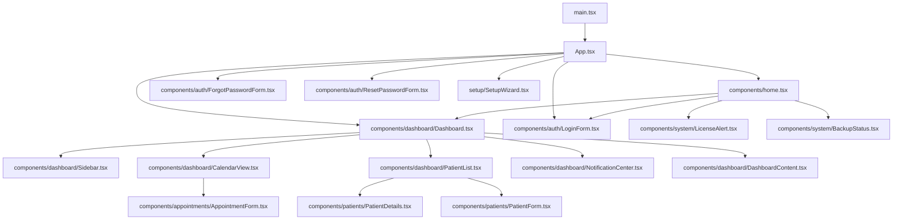
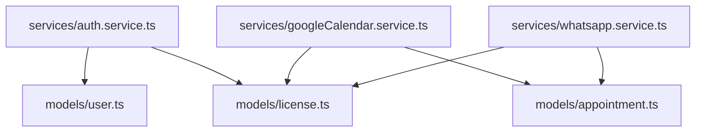

# Documentazione Tecnica - Sistema di Gestione Appuntamenti

## Indice
1. [Panoramica dell'Architettura](#panoramica-dellarchitettura)
2. [Struttura del Progetto](#struttura-del-progetto)
3. [Dipendenze tra File](#dipendenze-tra-file)
4. [Modelli e Database](#modelli-e-database)
5. [Servizi](#servizi)
6. [Componenti UI](#componenti-ui)
7. [Routing](#routing)
8. [Autenticazione](#autenticazione)
9. [Integrazioni Esterne](#integrazioni-esterne)
10. [Manutenzione e Modifiche](#manutenzione-e-modifiche)

## Panoramica dell'Architettura

Il Sistema di Gestione Appuntamenti è un'applicazione React che utilizza un'architettura a tre livelli:

1. **Livello di Presentazione**: Componenti React che formano l'interfaccia utente
2. **Livello di Servizio**: Classi di servizio che implementano la logica di business
3. **Livello di Dati**: Modelli che interagiscono con il database

L'applicazione è progettata per funzionare in locale, con un database PostgreSQL per la persistenza dei dati. Include integrazioni con Google Calendar e WhatsApp per la sincronizzazione degli appuntamenti e l'invio di notifiche.

## Struttura del Progetto

```
src/
├── components/         # Componenti UI React
├── lib/               # Utility e mock per ambiente browser
├── models/            # Modelli di dati e interazione con DB
├── services/          # Servizi di business logic
├── setup/             # Wizard di configurazione iniziale
├── App.tsx            # Componente principale e routing
└── main.tsx           # Entry point dell'applicazione
```

## Dipendenze tra File

### Dipendenze Principali



### Dipendenze dei Servizi



## Modelli e Database

### Schema del Database

Il database PostgreSQL contiene le seguenti tabelle:

1. **users**: Utenti del sistema (medici e assistenti)
2. **patients**: Anagrafica pazienti
3. **appointments**: Appuntamenti
4. **license**: Informazioni sulla licenza
5. **configurations**: Configurazioni di sistema

### Modelli e loro Relazioni con il Database

| Modello | File | Tabella DB | Operazioni |
|---------|------|------------|------------|
| UserModel | models/user.ts | users | create, findByUsername, findByEmail, findById, update, delete, authenticate, resetPassword |
| PatientModel | models/patient.ts | patients | create, findById, findByCodiceFiscale, findAll, update, delete |
| AppointmentModel | models/appointment.ts | appointments | create, findById, findByPatientId, findByDateRange, findByDate, findUpcoming, update, delete, updateGoogleCalendarSync, updateWhatsAppNotification, findPendingNotifications |
| LicenseModel | models/license.ts | license | getCurrentLicense, isLicenseValid, getDaysUntilExpiry, isGoogleCalendarEnabled, isWhatsAppEnabled, installLicense, verifyLicenseKey |
| Database | models/database.ts | Tutte | connect, query, getClient, close, initializeDatabase |

### Dettaglio delle Operazioni sui Modelli

#### UserModel (models/user.ts)

- **create**: Crea un nuovo utente con password criptata
- **findByUsername**: Cerca un utente per nome utente
- **findByEmail**: Cerca un utente per email
- **findById**: Cerca un utente per ID
- **update**: Aggiorna i dati di un utente
- **delete**: Elimina un utente
- **authenticate**: Verifica le credenziali di un utente
- **resetPassword**: Reimposta la password di un utente

#### PatientModel (models/patient.ts)

- **create**: Crea un nuovo paziente
- **findById**: Cerca un paziente per ID
- **findByCodiceFiscale**: Cerca un paziente per codice fiscale
- **findAll**: Recupera tutti i pazienti con paginazione e ricerca
- **update**: Aggiorna i dati di un paziente
- **delete**: Elimina un paziente

#### AppointmentModel (models/appointment.ts)

- **create**: Crea un nuovo appuntamento
- **findById**: Cerca un appuntamento per ID
- **findByPatientId**: Trova tutti gli appuntamenti di un paziente
- **findByDateRange**: Trova appuntamenti in un intervallo di date
- **findByDate**: Trova appuntamenti in una data specifica
- **findUpcoming**: Trova i prossimi appuntamenti
- **update**: Aggiorna un appuntamento
- **delete**: Elimina un appuntamento
- **updateGoogleCalendarSync**: Aggiorna lo stato di sincronizzazione con Google Calendar
- **updateWhatsAppNotification**: Aggiorna lo stato di notifica WhatsApp
- **findPendingNotifications**: Trova appuntamenti che necessitano di notifiche

#### LicenseModel (models/license.ts)

- **getCurrentLicense**: Ottiene la licenza corrente
- **isLicenseValid**: Verifica se la licenza è valida
- **getDaysUntilExpiry**: Calcola i giorni rimanenti alla scadenza
- **isGoogleCalendarEnabled**: Verifica se l'integrazione Google Calendar è abilitata
- **isWhatsAppEnabled**: Verifica se l'integrazione WhatsApp è abilitata
- **installLicense**: Installa una nuova licenza
- **verifyLicenseKey**: Verifica la validità di una chiave di licenza

## Servizi

### AuthService (services/auth.service.ts)

Gestisce l'autenticazione degli utenti e la verifica della licenza.

**Metodi principali**:
- **login**: Autentica un utente e verifica la validità della licenza
- **logout**: Disconnette l'utente corrente
- **getCurrentUser**: Ottiene l'utente correntemente autenticato
- **isAuthenticated**: Verifica se un utente è autenticato
- **requestPasswordReset**: Richiede un reset della password
- **resetPassword**: Reimposta la password con un token di reset

**Dipendenze**:
- UserModel
- LicenseModel

### GoogleCalendarService (services/googleCalendar.service.ts)

Gestisce l'integrazione con Google Calendar per la sincronizzazione degli appuntamenti.

**Metodi principali**:
- **isServiceEnabled**: Verifica se il servizio è abilitato dalla licenza
- **isServiceAuthenticated**: Verifica se il servizio è autenticato
- **authenticate**: Autentica l'applicazione con Google
- **syncAppointment**: Sincronizza un appuntamento con Google Calendar
- **deleteAppointment**: Elimina un appuntamento da Google Calendar
- **syncAllAppointments**: Sincronizza tutti gli appuntamenti futuri
- **disconnect**: Disconnette l'integrazione

**Dipendenze**:
- LicenseModel
- AppointmentModel

### WhatsAppService (services/whatsapp.service.ts)

Gestisce l'integrazione con WhatsApp per l'invio di notifiche automatiche.

**Metodi principali**:
- **isServiceEnabled**: Verifica se il servizio è abilitato dalla licenza
- **isServiceAuthenticated**: Verifica se il servizio è autenticato
- **configure**: Configura il servizio con i percorsi del browser e dei dati
- **authenticate**: Autentica WhatsApp Web
- **sendNotification**: Invia una notifica WhatsApp
- **sendAppointmentConfirmation**: Invia una conferma di appuntamento
- **sendAppointmentReminder**: Invia un promemoria di appuntamento
- **processPendingNotifications**: Elabora tutte le notifiche in attesa
- **disconnect**: Disconnette l'integrazione

**Dipendenze**:
- LicenseModel
- AppointmentModel

## Componenti UI

### Componenti Principali

| Componente | File | Descrizione |
|------------|------|-------------|
| App | src/App.tsx | Componente principale che gestisce il routing |
| Home | src/components/home.tsx | Pagina iniziale con login o dashboard |
| LoginForm | src/components/auth/LoginForm.tsx | Form di login |
| ForgotPasswordForm | src/components/auth/ForgotPasswordForm.tsx | Form per recupero password |
| ResetPasswordForm | src/components/auth/ResetPasswordForm.tsx | Form per reimpostare la password |
| Dashboard | src/components/dashboard/Dashboard.tsx | Layout principale dopo il login |
| Sidebar | src/components/dashboard/Sidebar.tsx | Barra laterale di navigazione |
| CalendarView | src/components/dashboard/CalendarView.tsx | Vista calendario appuntamenti |
| PatientList | src/components/dashboard/PatientList.tsx | Lista pazienti con ricerca e paginazione |
| NotificationCenter | src/components/dashboard/NotificationCenter.tsx | Centro notifiche WhatsApp |
| DashboardContent | src/components/dashboard/DashboardContent.tsx | Contenuto principale della dashboard |
| AppointmentForm | src/components/appointments/AppointmentForm.tsx | Form per creazione/modifica appuntamenti |
| PatientForm | src/components/patients/PatientForm.tsx | Form per creazione/modifica pazienti |
| PatientDetails | src/components/patients/PatientDetails.tsx | Dettagli paziente con schede |
| Settings | src/components/settings/Settings.tsx | Impostazioni dell'applicazione |
| BackupStatus | src/components/system/BackupStatus.tsx | Stato dei backup |
| LicenseAlert | src/components/system/LicenseAlert.tsx | Avviso scadenza licenza |
| SetupWizard | src/setup/SetupWizard.tsx | Wizard di configurazione iniziale |
| NotificationTemplates | src/components/settings/NotificationTemplates.tsx | Gestione template per notifiche WhatsApp |

### Dettaglio dei Componenti Principali

#### App (src/App.tsx)

Componente principale che gestisce il routing dell'applicazione. Utilizza React Router per definire le rotte disponibili.

**Rotte principali**:
- `/`: Home/Login
- `/calendar`: Vista calendario
- `/patients`: Lista pazienti
- `/patients/new`: Nuovo paziente
- `/patients/:id`: Dettagli paziente
- `/patients/:id/edit`: Modifica paziente
- `/notifications`: Centro notifiche
- `/settings`: Impostazioni
- `/forgot-password`: Recupero password
- `/reset-password`: Reset password
- `/setup`: Wizard di configurazione

#### Home (src/components/home.tsx)

Componente che mostra il form di login o la dashboard in base allo stato di autenticazione.

**Funzionalità**:
- Gestisce lo stato di autenticazione
- Mostra LoginForm se non autenticato
- Mostra Dashboard se autenticato
- Gestisce gli avvisi di licenza

#### Dashboard (src/components/dashboard/Dashboard.tsx)

Layout principale dell'applicazione dopo il login.

**Funzionalità**:
- Sidebar per la navigazione
- Visualizzazione del contenuto in base alla pagina attiva
- Gestione degli avvisi di sistema (licenza, backup)

#### CalendarView (src/components/dashboard/CalendarView.tsx)

Vista calendario per la gestione degli appuntamenti.

**Funzionalità**:
- Visualizzazione giornaliera, settimanale e mensile
- Creazione, modifica ed eliminazione appuntamenti
- Visualizzazione stato sincronizzazione e notifiche

#### PatientList (src/components/dashboard/PatientList.tsx)

Lista dei pazienti con funzionalità di ricerca e paginazione.

**Funzionalità**:
- Ricerca per nome, codice fiscale, email o telefono
- Paginazione dei risultati
- Azioni rapide (visualizza, modifica, elimina)

#### NotificationCenter (src/components/dashboard/NotificationCenter.tsx)

Centro di gestione delle notifiche WhatsApp.

**Funzionalità**:
- Visualizzazione notifiche inviate, in attesa e fallite
- Filtri per stato e tipo di notifica
- Invio manuale di notifiche

#### NotificationTemplates (src/components/settings/NotificationTemplates.tsx)

Gestione dei template per le notifiche WhatsApp.

**Funzionalità**:
- Creazione, modifica ed eliminazione di template
- Supporto per diversi tipi di template (appuntamento, promemoria, personalizzato)
- Utilizzo di segnaposto per dati dinamici

## Routing

L'applicazione utilizza React Router per la gestione delle rotte. Le rotte sono definite nel componente App.tsx.

```jsx
<Routes>
  <Route path="/" element={<Home />} />
  <Route path="/calendar" element={<CalendarView />} />
  <Route path="/patients" element={<PatientList />} />
  <Route path="/patients/new" element={<PatientForm />} />
  <Route path="/patients/:id" element={<PatientDetails />} />
  <Route path="/patients/:id/edit" element={<PatientForm />} />
  <Route path="/notifications" element={<NotificationCenter />} />
  <Route path="/settings" element={<Settings />} />
  <Route path="/forgot-password" element={<ForgotPasswordForm />} />
  <Route path="/reset-password" element={<ResetPasswordForm />} />
  <Route path="/setup" element={<SetupWizard />} />
</Routes>
```

### Flusso di Navigazione

1. L'utente accede all'applicazione (`/`)
2. Se non autenticato, viene mostrato il form di login
3. Dopo l'autenticazione, viene mostrata la dashboard
4. L'utente può navigare tra le diverse sezioni tramite la sidebar o la barra di navigazione superiore

## Autenticazione

Il sistema di autenticazione è gestito dal servizio AuthService.

### Processo di Login

1. L'utente inserisce username e password nel LoginForm
2. AuthService.login verifica le credenziali contro il database
3. Viene verificata anche la validità della licenza
4. Se tutto è valido, l'utente viene autenticato e reindirizzato alla dashboard

### Gestione della Sessione

La sessione utente è gestita tramite localStorage:

- `currentUser`: Dati dell'utente autenticato
- `authToken`: Token di autenticazione
- `isAuthenticated`: Flag che indica se l'utente è autenticato

### Recupero Password

1. L'utente richiede il reset della password tramite ForgotPasswordForm
2. Viene generato un token di reset e (in un'implementazione reale) inviato via email
3. L'utente utilizza il token per accedere al ResetPasswordForm
4. La nuova password viene salvata nel database

## Integrazioni Esterne

### Google Calendar

L'integrazione con Google Calendar è gestita dal servizio GoogleCalendarService.

**Configurazione**:
1. L'utente deve avere una licenza che include l'integrazione Google Calendar
2. L'utente configura le credenziali OAuth2 (Client ID, Client Secret, URI di reindirizzamento)
3. L'applicazione si autentica con Google

**Sincronizzazione**:
- Gli appuntamenti vengono sincronizzati automaticamente con Google Calendar
- Le modifiche agli appuntamenti vengono propagate a Google Calendar
- Gli appuntamenti eliminati vengono rimossi da Google Calendar

### WhatsApp

L'integrazione con WhatsApp è gestita dal servizio WhatsAppService.

**Configurazione**:
1. L'utente deve avere una licenza che include l'integrazione WhatsApp
2. L'utente configura il percorso del browser Chrome/Chromium e il percorso dei dati
3. L'applicazione avvia WhatsApp Web e l'utente scansiona il codice QR

**Notifiche**:
- Conferme di appuntamento: inviate quando viene creato un nuovo appuntamento
- Promemoria: inviati il giorno prima dell'appuntamento
- Notifiche manuali: l'utente può inviare notifiche personalizzate

## Funzionalità Aggiuntive

### Template per Notifiche WhatsApp

Il sistema supporta la creazione e gestione di template personalizzati per le notifiche WhatsApp, accessibili dalla sezione Impostazioni > Notifiche per gli utenti con licenza WhatsApp o Full.

**Caratteristiche principali:**
- Creazione di template personalizzati con segnaposto per dati dinamici
- Supporto per diversi tipi di template: Appuntamento, Promemoria, Personalizzato
- Possibilità di modificare ed eliminare i template esistenti
- Utilizzo automatico dei template per le notifiche di conferma, promemoria e cancellazione appuntamenti

**Segnaposto supportati:**
- `{paziente}`: Nome e cognome del paziente
- `{data}`: Data dell'appuntamento
- `{ora}`: Orario dell'appuntamento

### Backup Reale del Database

Il sistema ora supporta il backup reale del database PostgreSQL utilizzando il comando `pg_dump`.

**Caratteristiche principali:**
- Backup completo del database in formato binario
- Generazione automatica del nome del file con timestamp
- Possibilità di eseguire backup manuali o automatici
- Ripristino da backup tramite `pg_restore`

### Gestione Appuntamenti Migliorata

La gestione degli appuntamenti è stata migliorata con le seguenti funzionalità:

- Salvataggio effettivo degli appuntamenti in localStorage
- Sincronizzazione con Google Calendar (per licenze Google o Full)
- Invio automatico di notifiche WhatsApp per conferma, promemoria e cancellazione (per licenze WhatsApp o Full)
- Eliminazione di appuntamenti con notifica al paziente

## Manutenzione e Modifiche

### Aggiunta di Nuove Funzionalità

1. **Nuovi Componenti UI**:
   - Creare il nuovo componente in `src/components/`
   - Aggiungere la rotta in `App.tsx` se necessario
   - Aggiornare la navigazione in `Sidebar.tsx` e/o `TopNavigation.tsx`

2. **Nuove Funzionalità di Database**:
   - Aggiungere i nuovi campi/tabelle in `models/database.ts` nel metodo `initializeDatabase`
   - Creare o aggiornare il modello corrispondente in `src/models/`
   - Aggiornare i servizi che utilizzano il modello

3. **Nuove Integrazioni**:
   - Creare un nuovo servizio in `src/services/`
   - Aggiornare il modello `License` per includere il controllo della nuova funzionalità
   - Aggiungere l'interfaccia utente per la configurazione in `Settings.tsx`

### Gestione delle Licenze

Per modificare il sistema di licenze:

1. Aggiornare `models/license.ts` con i nuovi tipi di licenza o funzionalità
2. Modificare il metodo `verifyLicenseKey` per supportare le nuove chiavi
3. Aggiornare l'interfaccia utente in `setup/SetupWizard.tsx` e `components/settings/Settings.tsx`

### Aggiornamento del Database

Per aggiornare lo schema del database:

1. Modificare il metodo `initializeDatabase` in `models/database.ts`
2. Creare una funzione di migrazione per aggiornare i database esistenti
3. Aggiornare i modelli interessati con i nuovi campi/metodi

### Generazione del Codice Fiscale

Il sistema genera automaticamente il codice fiscale italiano basandosi sui dati anagrafici del paziente. L'algoritmo di generazione è implementato nel componente `PatientForm.tsx` e segue queste regole:

1. **Cognome**: Prende le prime 3 consonanti del cognome. Se non ci sono abbastanza consonanti, usa le vocali. Se il cognome è troppo corto, aggiunge delle X.

2. **Nome**: Se il nome ha almeno 4 consonanti, prende la 1ª, 3ª e 4ª consonante. Altrimenti, prende le prime 3 consonanti. Se non ci sono abbastanza consonanti, usa le vocali. Se il nome è troppo corto, aggiunge delle X.

3. **Data di nascita e genere**:
   - Anno: Le ultime 2 cifre dell'anno di nascita
   - Mese: Una lettera da A a T secondo la tabella dei mesi (A=gennaio, B=febbraio, ecc.)
   - Giorno: Il giorno di nascita (01-31) per i maschi, il giorno + 40 per le femmine

4. **Comune di nascita**: Il codice catastale del comune di nascita (4 caratteri alfanumerici)

5. **Carattere di controllo**: Nell'implementazione attuale, questo carattere non viene calcolato per semplicità.

#### Gestione dei Comuni

I comuni italiani e i relativi codici catastali sono memorizzati nel file `src/data/comuni-italiani.json`. È possibile aggiungere nuovi comuni in due modi:

1. **Tramite l'interfaccia utente**:
   - Nel form di inserimento paziente, quando si seleziona la città di nascita, è possibile aggiungere un nuovo comune cliccando sul pulsante "+"
   - Inserire il nome del comune e il codice catastale
   - Il nuovo comune viene salvato in localStorage e sarà disponibile per future selezioni

2. **Modificando il file JSON**:
   - Aprire il file `src/data/comuni-italiani.json`
   - Aggiungere un nuovo oggetto con la seguente struttura: `{ "nome": "NomeComune", "codice": "XXXX" }`
   - Il codice catastale deve essere di 4 caratteri (solitamente una lettera seguita da 3 numeri)

I comuni aggiunti tramite l'interfaccia utente vengono salvati in localStorage con la chiave 'italianCities' e vengono caricati all'avvio dell'applicazione.

### Risoluzione dei Problemi Comuni

1. **Problemi di Autenticazione**:
   - Verificare `AuthService` e `UserModel`
   - Controllare la validità della licenza in `LicenseModel`

2. **Problemi di Sincronizzazione Google Calendar**:
   - Verificare le credenziali OAuth2
   - Controllare `GoogleCalendarService` e i log di errore
   - Verificare che la licenza includa questa funzionalità

3. **Problemi con le Notifiche WhatsApp**:
   - Verificare che Chrome/Chromium sia installato e accessibile
   - Controllare che WhatsApp Web sia autenticato
   - Verificare `WhatsAppService` e i log di errore
   - Verificare che la licenza includa questa funzionalità

4. **Problemi di Database**:
   - Verificare la connessione al database in `Database.getInstance()`
   - Controllare i log di errore per le query fallite
   - Verificare che lo schema del database sia aggiornato
   
5. **Problemi di Backup**:
   - Verificare che il percorso di backup specificato esista e sia accessibile
   - Controllare i permessi di scrittura nella directory di backup
   - Verificare lo spazio disponibile sul disco
   
6. **Problemi con il Codice Fiscale**:
   - Verificare che tutti i dati anagrafici siano inseriti correttamente
   - Controllare che il comune di nascita sia presente nell'elenco con il codice catastale corretto
   - Se il codice generato non è corretto, è possibile inserirlo manualmente